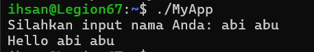

**Nama : Muhammad Ihsan Malarangeng**
**NRP : 5024251067**

## Tugas 0 
bertujuan untuk melakukan modifikasi pada program dasar c++ "Hello World"

## Source code

```cpp
#include <iostream>
#include <string>
int main() {
    std::string nama;


    std::cout << "Silahkan input nama Anda: ";
    
 
    std::getline(std::cin, nama);


    std::cout << "Hello " << nama << std::endl;

    return 0;
}
```


Ini adalah Screenshot hasilnya 